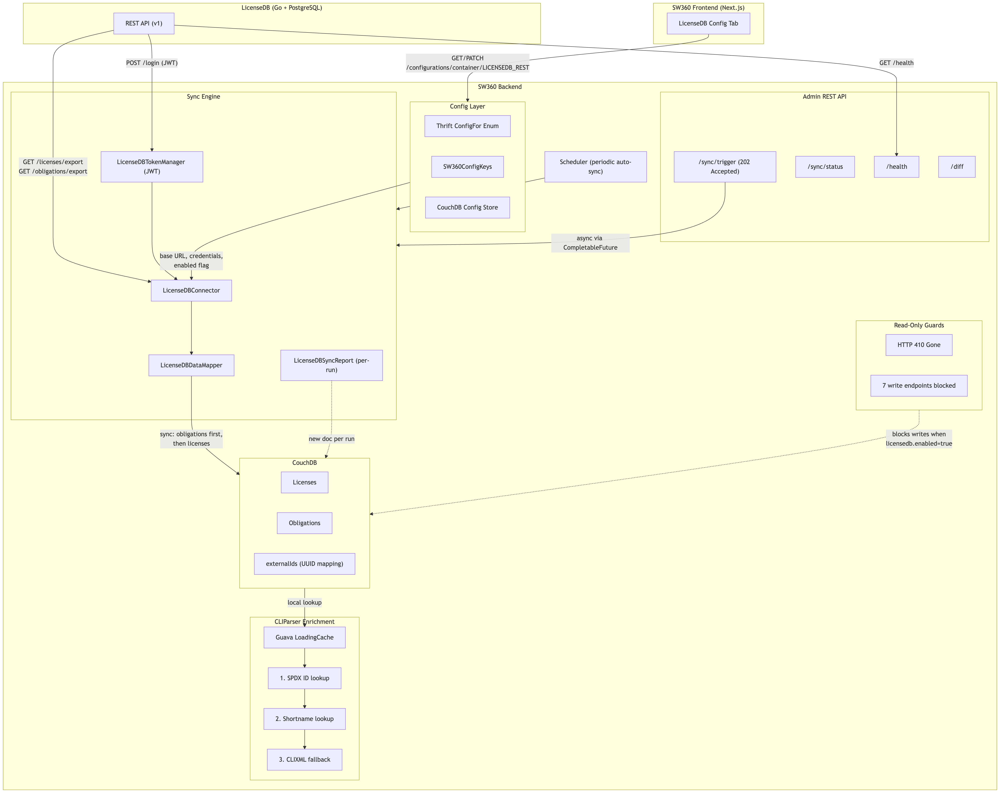

# GSoC 2026


<a href="https://summerofcode.withgoogle.com/programs/2026/projects">
  
</a>

## *Integration of SW360 and LicenseDB @ [SW360](https://www.eclipse.org/sw360/)*

---

# Project Details

**Organization:** [The Eclipse Foundation](https://www.eclipse.org/)

**Project:** [SW360](https://github.com/eclipse-sw360/sw360), an open-source software catalogue for managing components, licenses, and obligations.

**Mentors:** Gaurav Mishra ([@GMishx](https://github.com/GMishx)), Keerthi B L ([@keerthi-bl](https://github.com/keerthi-bl)), Akshit Joshi ([@akshitjoshii](https://github.com/akshitjoshii)), Farooq Fateh Aftab ([@Farooq-Fateh-Aftab](https://github.com/Farooq-Fateh-Aftab))

**Contributor:** Sandip Mandal ([@Sandipmandal25](https://github.com/Sandipmandal25))

**Proposal:** [Integration of SW360 and LicenseDB](https://docs.google.com/document/d/1ugfuG8x_ZMX-yMNnAfjdjUIKgJMQI3d079iqCaXlHYI/edit?usp=sharing)

**Integration branch:** [`feat/licensedb/integration`](https://github.com/eclipse-sw360/sw360/tree/feat/licensedb/integration)

**All PRs:** [eclipse-sw360/sw360 by Sandipmandal25](https://github.com/eclipse-sw360/sw360/pulls?q=is:pr+author:Sandipmandal25)

**Total:** 8 PRs (6 merged, 2 open) across 76 files, +2,649 / -95 lines

## What's this project actually about?

SW360 manages software compliance, but for a long time it maintained its own license data through manual imports from SPDX and OSADL. That's slow to keep current and easy to drift out of sync with reality.

[LicenseDB](https://github.com/fossology/LicenseDb) is FOSSology's centralized license and obligation database, and the goal of this project was to make it the single source of truth for SW360 instead. Once you turn the integration on, SW360 periodically pulls license and obligation data from LicenseDB into its local CouchDB, locks down the license write endpoints (since there's now an upstream owner for that data), and enriches whatever it parses out of CLIXML attachments with the canonical LicenseDB data.

Importantly, none of this is forced on anyone. `licensedb.enabled` is `false` by default, so existing SW360 deployments don't notice anything changed until an admin opts in and points it at a LicenseDB instance.

---

# Architecture



```
┌──────────────────────────────────────────────────────────────┐
│                        SW360 Backend                         │
│                                                              │
│  ┌─────────────────┐    ┌──────────────────────────────────┐ │
│  │  Config Layer    │    │          Sync Engine             │ │
│  │  (Thrift enum +  │    │  LicenseDBConnector              │ │
│  │   ConfigKeys +   │◄──►│  LicenseDBTokenManager (JWT)     │ │
│  │   CouchDB store) │    │  LicenseDBDataMapper             │ │
│  └─────────────────┘    │  LicenseDBSyncReport (per-run)   │ │
│                          └──────────┬───────────────────────┘ │
│                                     │                         │
│  ┌─────────────────┐                │  sync                   │
│  │  Read-Only       │                ▼                         │
│  │  Guards (410)    │    ┌──────────────────────────────────┐ │
│  │  7 write         │    │         CouchDB                  │ │
│  │  endpoints       │    │  Licenses + Obligations          │ │
│  │  blocked         │    │  (with externalIds UUIDs)        │ │
│  └─────────────────┘    └──────────┬───────────────────────┘ │
│                                     │                         │
│  ┌─────────────────┐                │  lookup                 │
│  │  CLIParser       │                ▼                         │
│  │  Enrichment      │    ┌──────────────────────────────────┐ │
│  │  (SPDX ID →      │◄──►│  License + Obligation lookup     │ │
│  │   shortname →     │    │  (Guava LoadingCache)            │ │
│  │   CLIXML fallback)│    └──────────────────────────────────┘ │
│  └─────────────────┘                                          │
│                                                              │
│  ┌─────────────────┐    ┌──────────────────────────────────┐ │
│  │  Admin REST API  │    │  Scheduler Integration           │ │
│  │  /sync/trigger   │    │  (periodic auto-sync)            │ │
│  │  /sync/status    │    │  Async via CompletableFuture     │ │
│  │  /health         │    │  Returns 202 Accepted            │ │
│  │  /diff           │    └──────────────────────────────────┘ │
│  └─────────────────┘                                          │
└──────────────────────────────────────────────────────────────┘
                              │
                              │ GET /api/v1/licenses/export
                              │ GET /api/v1/obligations/export
                              │ POST /api/v1/login (JWT)
                              │ GET /api/v1/health
                              ▼
                     ┌──────────────────┐
                     │    LicenseDB     │
                     │  (Go + PostgreSQL)│
                     └──────────────────┘
```

Sync order matters here: obligations go first, then licenses, then the two get cross-linked by UUID. Every run does a full export rather than a diff (more on why that's a problem later), and SW360-native fields (whitelist, checked, FSFLibre, non-LicenseDB obligations) are never touched by the sync.

---

# Contributions

### Backend: [eclipse-sw360/sw360](https://github.com/eclipse-sw360/sw360) | Frontend: [eclipse-sw360/sw360-frontend](https://github.com/eclipse-sw360/sw360-frontend)

## Phase 1: Config container + HTTP client

First step was just getting SW360 able to talk to LicenseDB at all.

SW360 already had a pattern for storing external service configuration. There's a Thrift enum that identifies each config container, a set of string keys for the individual settings, and a CouchDB-backed store that holds the values. I added a new container for LicenseDB following that exact pattern, with four keys: enabled flag, base URL, username, and password. The credential keys are restricted to admin-only access.

On top of that I built the HTTP client layer. A connector class that fetches all licenses and obligations from LicenseDB's export endpoints, filtering out inactive ones on the client side. A token manager that handles JWT login, caches the token, and refreshes it before expiry (with a 60-second buffer so it doesn't die mid-request). And a pair of DTOs for deserializing the LicenseDB JSON responses, with null-safe getters since the export payloads aren't always fully populated.

> **PR:** [#4268: add LicenseDB config container and HTTP client layer](https://github.com/eclipse-sw360/sw360/pull/4268) `MERGED`

## Phase 1: The sync engine itself

This is where the actual import happens. A mapper converts LicenseDB's data format into SW360's internal Thrift objects, including mapping obligation types between the two systems (OBLIGATION, RISK, and RESTRICTION carry over directly, but LicenseDB's RIGHT maps to SW360's PERMISSION). The sync method in the license database handler does the work: obligations first, then licenses, then cross-linking the two by UUID.

The trickiest part wasn't the happy path, it was bootstrapping. On the very first sync there's no LicenseDB UUID attached to anything yet. Rather than require a separate migration script, the first sync just matches existing licenses by shortname and attaches the UUID from there on out. That way deployments with years of existing license data can start syncing without any prep work.

The other important constraint: anything that's SW360-native (whitelist flags, human-reviewed markers, obligations that weren't synced from LicenseDB) is left completely alone during sync. The engine only touches data it owns.

This is also wired into SW360's built-in scheduler so it can run automatically on a configurable interval.

> **PR:** [#4292: Add sync engine to import licenses and obligations from LicenseDB](https://github.com/eclipse-sw360/sw360/pull/4292) `MERGED`

## Phase 2: Frontend config tab

The backend config was useless without a way for admins to actually flip it on. This added a "LicenseDB Configurations" tab to the admin settings page in the frontend, with a toggle for enabling/disabling the integration and fields for the connection details (base URL, username, password). It follows the same component pattern the other config tabs use, hitting the REST API from Phase 1 to read and save settings.

> **PR:** [eclipse-sw360/sw360-frontend#1797: Add LicenseDB configuration tab in admin configurations UI](https://github.com/eclipse-sw360/sw360-frontend/pull/1797) `MERGED`

## Phase 3: Making license writes read-only

Once LicenseDB owns the data, letting people edit licenses directly in SW360 stops making sense. You'd just get overwritten on the next sync anyway.

So when the integration is enabled, all seven license write endpoints now return HTTP 410 Gone with a message pointing to the sync endpoint instead. That covers create, update, delete, bulk delete, SPDX import, OSADL import, and CSV upload. The operations that are genuinely SW360's own (editing whitelist, linking/unlinking obligations manually) stay open since those represent local overlay data that the sync engine explicitly preserves.

> **PR:** [#4370: Block license writes with HTTP 410 when LicenseDB integration is enabled](https://github.com/eclipse-sw360/sw360/pull/4370) `MERGED`

## Phase 3: Admin endpoints for sync + health

Admins needed some visibility into what the sync engine was actually doing. This added three REST endpoints:

- `POST /licenseDB/sync/trigger` triggers a full sync (runs async, returns 202 immediately)
- `GET /licenseDB/sync/status` returns the latest sync report
- `GET /licenseDB/health` pings LicenseDB to verify the connection is alive

Each sync run writes a new report document to CouchDB rather than overwriting the last one, so there's a full history of runs with timing, counts, and pass/fail status. The status endpoint queries these reports using a CouchDB Mango index to find the latest one. All three endpoints require admin privileges.

> **PR:** [#4372: Add admin endpoints for LicenseDB sync and health monitoring](https://github.com/eclipse-sw360/sw360/pull/4372) `MERGED`

## Phase 3: CLIParser enrichment

When SW360 processes component attachments (CLIXML files), it parses out license information. But the text in those files is often incomplete or inconsistent compared to what's in the database.

This phase added a lookup step to the parser: when it finds a license in a CLIXML, it tries to match it against the local CouchDB data (which is now synced from LicenseDB). First by SPDX ID, then by shortname, and if neither matches it keeps the CLIXML data as-is. The lookup uses an in-memory cache that only loads when the integration is enabled, so there's zero overhead when the feature is off. Both of SW360's CLI parsers benefit since the enrichment lives in their shared parent class.

> **PR:** [#4408: CLIParser enrichment with LicenseDB data](https://github.com/eclipse-sw360/sw360/pull/4408) `MERGED`

## Phase 4: Security hardening + diff endpoint

This one came out of a review comment, honestly. Someone pointed out that the LicenseDB base URL is admin-configurable, which means it's an SSRF vector if it's not validated. So I added URL validation that blocks private and loopback IPs, plus retry logic with exponential backoff for transient network failures.

Also added a diff endpoint that compares what's in SW360's local database against what's currently in LicenseDB, so admins can see what would change before triggering a sync.

> **PR:** [#4427: add URL validation, retry logic, and license diff endpoint](https://github.com/eclipse-sw360/sw360/pull/4427) `OPEN`

## Phase 4: Obligation enrichment

Last piece. The CLIParser enrichment from Phase 3 covered licenses but not the obligations attached to them. This extends it so that when a license is matched against CouchDB, its obligations also get sourced from the database instead of whatever the CLIXML said. Only obligations that actually came from LicenseDB are swapped out. Anything that was added directly in SW360 stays as-is.

> **PR:** [#4439: enrich parsed licenses with LicenseDB obligations](https://github.com/eclipse-sw360/sw360/pull/4439) `OPEN`

---

# Deliverables

| Task | Planned | Status |
| :--- | :-----: | :----: |
| LicenseDB config container and storage | Yes | Merged |
| HTTP client with JWT auth | Yes | Merged |
| Full sync engine (licenses + obligations + cross-linking) | Yes | Merged |
| Frontend admin configuration tab | Yes | Merged |
| Read-only guards on write endpoints | Yes | Merged |
| Admin endpoints (sync trigger, status, health) | Yes | Merged |
| CLIParser license enrichment | Yes | Merged |
| Async sync trigger | Yes | Merged |
| Scheduler integration (periodic auto-sync) | Yes | Merged |
| Per-run sync reporting | No | Merged |
| Security hardening (SSRF validation, retry logic) | Yes | Open |
| License diff comparison endpoint | No | Open |
| Obligation enrichment in CLIParser | Yes | Open |

---

# Key design decisions (and why)

**One-way sync, LicenseDB to SW360 only.** Once the integration is on, SW360 goes fully read-only for license data. Anything else risks two sources of truth fighting each other.

**Opt-in, always.** The integration is off by default. Nobody's deployment should change behavior without them asking for it.

**No live API calls at request time.** Everything gets synced to local CouchDB on a schedule. Lookups during normal operation are all local. This keeps SW360 from having a hard runtime dependency on LicenseDB being up.

**Never clobber SW360-native data.** Whitelist flags, human-reviewed markers, and any obligation without a LicenseDB ID survive every sync untouched.

**No migration script for bootstrapping.** First sync just matches by shortname and attaches the UUID from there. Simpler than it sounds, and it avoids a whole separate migration path.

**A new report doc per sync run**, not an overwrite. This gives you a queryable history instead of just the latest state.

**JWT auth via LicenseDB's own login endpoint**, not OAuth/OIDC. That's just what LicenseDB exposes. Token manager handles refresh with a buffer so requests don't race an expiring token.

---

# What's left / open questions

### Open PRs (code complete, under review)

- [#4427 Security hardening + license diff endpoint](https://github.com/eclipse-sw360/sw360/pull/4427): SSRF validation, retry logic, and diff comparison endpoint.
- [#4439 Obligation enrichment in CLIParser](https://github.com/eclipse-sw360/sw360/pull/4439): extends CLIParser enrichment to also cover obligations, not just licenses.

### Future work

- **Incremental sync.** Right now every run does a full export, which won't scale forever. LicenseDB has an `/audits` endpoint that could support incremental sync. Didn't get to it this cycle.
- **License-to-release mapping.** Still an open question whether to match by shortname or add a dedicated field. Needs more design discussion before it's built.
- **Obligation UUID stability.** LicenseDB supports hard-deleting obligations, which can break UUID matching on the SW360 side. Needs some kind of reconciliation strategy. Haven't settled on one yet.

---

# What I actually took away from this

Going in, I underestimated how much of this project would be about *not* overwriting things rather than writing them. The sync engine itself is conceptually simple (pull data, map it, store it) but getting the "preserve local overlays" behavior right took a lot more care than I expected, especially with obligations that may or may not have come from LicenseDB in the first place.

I also got a lot more comfortable with SW360's stack than I was going in: Thrift for the RPC layer, CouchDB's document model and Mango queries, the way config containers flow from a backend enum all the way up to a frontend toggle. None of that was intuitive on day one.

The SSRF issue in Phase 4 was a good reminder that "admin-only" doesn't automatically mean "safe". An admin-configurable URL is still user input from the app's perspective. That one came from review, not from me catching it myself, which was a useful nudge to think more like an attacker when reviewing my own code.

The code review process across multiple PRs taught me more about *why* certain patterns exist in a large codebase than reading the code cold ever could. A lot of "why is this done this way" turned out to have a good reason once a mentor explained it.
